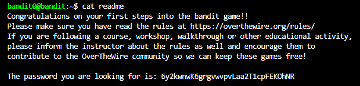

# NHIỆM VỤ
Sau khi truy cập vào game (ở level 0), lấy password trong file "readme".

# LỜI GIẢI
Dùng lệnh sau để hệ thống hiển thị toàn bộ file trong server:
```bash
ls -al
```

Sau khi nhập lệnh, terminal sẽ trả về như sau:


Lúc này ta chỉ cần nhập lệnh sau để hệ thống in ra file "readme":
```bash
cat readme
```



# PASSWORD
```
6y2kwnwK6grgvwvpvLaa2T1cpFEKOhNR
```
 