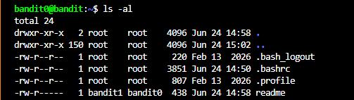

# OBJECTIVE
After logging in to the game at level 0, get the password in the readme file.

# SOLUTION
Use this command to show all files and directories in the current directory on the server:
```bash
ls -al
```

After executing the command, the terminal will output the following:



Then we can use this command to get the password:
```bash
cat readme
```


# PASSWORD
```
6y2kwnwK6grgvwvpvLaa2T1cpFEKOhNR
```
 