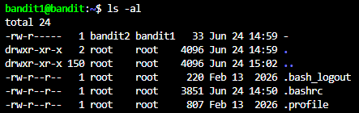
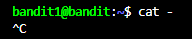
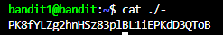

# NHIỆM VỤ
Truy cập vào game bằng username bandit1, sau đó lấy password trong file "-".

# LỜI GIẢI
Truy cập game: Dùng lệnh ssh với các thông tin sau:
- Host: bandit.labs.overthewire.org
- Port: 2220 
- Username: bandit[level]
- Password: [Password ở level trước]

(**LƯU Ý**: Hướng dẫn trên áp dụng cho hầu hết những level sau, do đó các writeup sau sẽ không nhắc lại cái này nữa.)

Dùng lệnh sau để hệ thống hiển thị toàn bộ file và thư mục trong thư mục hiện tại trong server:
```bash
ls -al
```

Sau khi nhập lệnh, terminal sẽ trả về như sau:



Lúc này ta chỉ cần in ra file "-" là xong. Tuy nhiên, nếu ta nhập:
```bash
cat -
```
Hệ thống sẽ hiểu là đọc dữ liệu nhập từ bàn phím, thay vì từ file ta cần. Trong trường hợp đó, ta phải bấm tổ hợp phím Ctrl + C để hệ thống dừng thực thi lệnh đó.



Để hệ thống in ra file "-", ta cần nhập 1 trong 2 lệnh sau:
```bash
cat ./- #Lúc này hệ thống sẽ hiểu đây là đường dẫn tệp tin
cat -- - #Báo hiệu kết thúc options
```



# PASSWORD
```
PK8fYLZg2hnHSz83plBL1iEPKdD3QToB
```
 