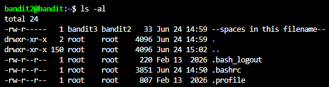
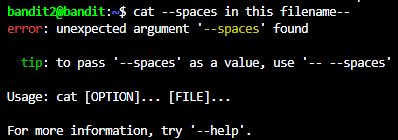
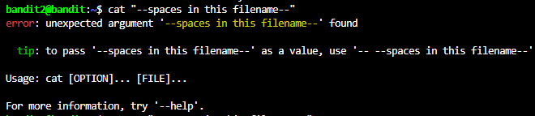
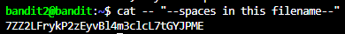

# NHIỆM VỤ
Truy cập vào game bằng username bandit2, sau đó lấy password trong file "--spaces in this filename--".

# LỜI GIẢI
Dùng lệnh sau để hệ thống hiển thị toàn bộ file trong server:
```bash
ls -al
```

Sau khi nhập lệnh, terminal sẽ trả về như sau:



Ta cần in ra file "--spaces in this filename--". Tuy nhiên, tương tự level trước, ta không thể nhập trực tiếp tên file như sau:
```bash
cat --spaces in this filename--
```

Lý do: Trong tên file có chứa khoảng trắng, và bắt đầu bằng "--". Nếu cố gắng thực thi lệnh trên, hệ thống sẽ hiểu mỗi phần là 1 option riêng biệt, và trả kết quả như sau:



Để hệ thống nhận diện toàn bộ chuỗi là 1 tên file duy nhất, ta cần đặt toàn bộ chuỗi vào dấu ngoặc kép (""). Nhưng, nếu ta vội vàng nhập lệnh:
```bash
cat "--spaces in this filename--"
```

Hệ thống vẫn sẽ báo lỗi như sau:



Lý do: Mặc dù đã đặt trong "", chuỗi vẫn bắt đầu bằng "--", hệ thống vẫn sẽ hiểu đây là 1 option, và sẽ báo lỗi. Do đó, ta cần nhập lại lệnh cat như ở level trước, và hệ thống sẽ trả về password như sau:



# PASSWORD
```
7ZZ2LFrykP2zEyvBl4m3clcL7tGYJPME
```
 