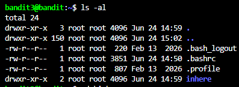
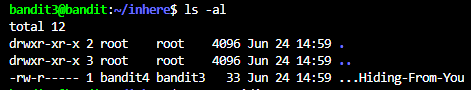
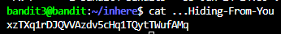

# NHIỆM VỤ
Truy cập vào game bằng username bandit3, sau đó lấy password trong file được ẩn trong thư mục "inhere".

# LỜI GIẢI
Dùng lệnh sau để hệ thống hiển thị toàn bộ file và thư mục trong thư mục hiện tại trong server:
```bash
ls -al
```

Sau khi nhập lệnh, terminal sẽ trả về như sau:



Nhập lệnh sau để truy cập vào thư mục mục tiêu:
```bash
cd ./inhere
```

Sau khi nhập lệnh, dòng prompt của ta sẽ trỏ đến thư mục inhere như sau:


Tiếp tục dùng lại lệnh đầu tiên để hiển thị toàn bộ file trong thư mục:



Ta sẽ thấy có 1 file tên là "...Hiding-From-You". Nhập lệnh sau để terminal in nội dung file:

```bash
cat ...Hiding-From-You
```



# PASSWORD
```
xzTXq1rDJQVVAzdv5cHq1TQytTWufAMq
```
 