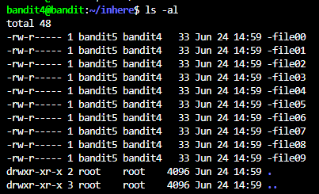
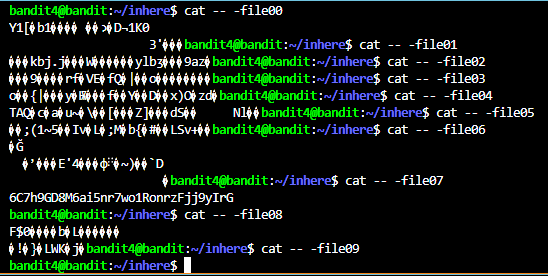

# OBJECTIVE
In the "inhere" directory, get the password in the only human-readable file.

# SOLUTION
Similar to the previous level, we need to access the "inhere" directory. So, we can use `cd` command to access the directory like this:
```bash
cd ./inhere
```

Then, use this command to show all files in the directory:
```bash
ls -al
```

 

Since there are a few files in the directory (about 10 files), we can `cat` every single file to find the password.
```bash
cat -- -file0x #NOTE: Don't forget to add '--' to signal end of the options
```



# PASSWORD
```
6C7h9GD8M6ai5nr7wo1RonrzFjj9yIrG
```
 