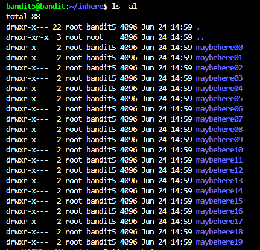
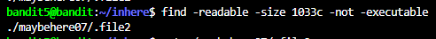
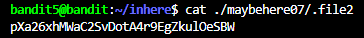

# NHIỆM VỤ
Truy cập vào thư mục "inhere", sau đó lấy password trong file có các thuộc tính sau:
- Đọc được
- Size: 1033 bytes
- Không thể thực thi

# LỜI GIẢI
Tương tự level trước, ta cần truy cập vào thư mục "inhere". Do đó, ta có thể dùng lệnh `cd` để truy cập vào thư mục như sau:
```bash
cd ./inhere
```

Sau đó, ta sử dụng lệnh sau để hiển thị toàn bộ file trong thư mục:
```bash
ls -al
```



Mặc dù ta có thể duyệt hết toàn bộ thư mục như level trước, nhưng nó sẽ CỰC KỲ TỐN THỜI GIAN. Thay vào đó, vì ta đã có các thuộc tính của nó, ta có thể dùng lệnh `find` với cú pháp sau:

```bash
find -readable -size 1033c -not -executable
```

Giải thích lệnh:
- `-readable`: Tìm file có thể đọc được
- `-size 1033c`: Tìm theo size của file (mặc định sẽ tìm theo `b`(block 512 bytes), nên ta phải chọn tìm theo `c` (bytes)) 
- `-not -executable`: Tìm file không thể thực thi (option `-not` ở phía trước báo hiệu tìm những cái sau theo hướng ngược lại) 

Sau khi thực thi, màn hình sẽ trả về như sau:



Ta thấy chỉ có file `./maybehere07/.file2` là thỏa mãn tất cả những thuộc tính trên. Cuối cùng, ta chỉ cần `cat` file đó để lấy password.



# PASSWORD
```
pXa26xhMWaC2SvDotA4r9EgZkulOeSBW
```
 