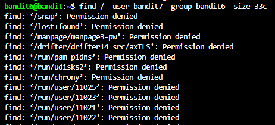
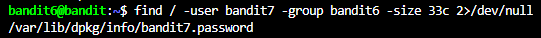

# OBJECTIVE
Get the password in the file that has these properties:
- User: bandit7
- Group: bandit6
- Size: 33 bytes
Range: Every single file on the server.

# SOLUTION
Similar to the previous level, we can use the `find` command to find the file that satisfies the objective. However, the search range is now THE ENTIRE SERVER. So, we have to add `/` as the search path to check every single file on the server: 
```bash
find / -user bandit7 -group bandit6 -size 33c
```

Command explanation:
- `-user bandit7`: This file belongs to user bandit7.
- `-group bandit6`: This file belongs to group bandit6.

The terminal will return the following:



We found that there are many matching results, but most of them come up with `Permission denied`. Therefore, we need to filter them by adding `2>/dev/null` to the command like this:
```bash
find / -user bandit7 -group bandit6 -size 33c 2>/dev/null # Permission denied will return error code 2 -> Push all of them to null
```



Finally, copy the file path and pass it to the `cat` command to get the password.


# PASSWORD
```
Bmnnvf82KzQlfxgAI2d1zYbr1u9pr3E3
```
 