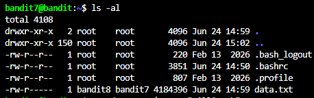
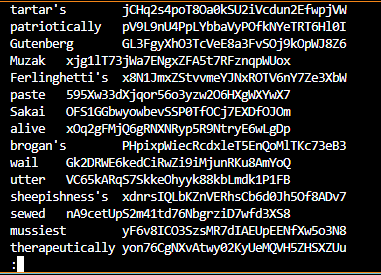
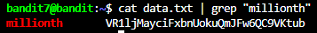

# NHIỆM VỤ
Trong file data.txt, tìm password ở bên cạnh từ "millionth".

# LỜI GIẢI
Dùng lệnh sau để hệ thống hiển thị toàn bộ file và thư mục trong thư mục hiện tại trong server:
```bash
ls -al
```

Terminal sẽ trả về như sau:



Công việc hiện tại của ta là truy cập vào file mục tiêu và lấy password. Tuy nhiên, nếu ta vội vàng dùng `cat data.txt`, ta sẽ gặp 1 vấn đề: Terminal sẽ ngập trong các chuỗi ký tự. Ví dụ 1 phần trong file:



1 điều rất rõ ràng là ta không thể đọc từng dòng được. Do đó, ta phải dùng 1 lệnh tương tự lệnh `find`, nhưng tìm trong nội bộ file - lệnh `grep`. Thao tác của ta sẽ như sau:
```bash
# LƯU Ý: Nhớ đặt từ cần tìm vào ngoặc kép ("")!!
cat data.txt | grep "millionth"
```



**NOTE**: Vì lệnh `grep` cũng có thể tự đọc file, ta có thể bỏ bớt lệnh `cat` như sau:
```bash
grep "millionth" data.txt
```

# PASSWORD
```
VR1ljMayciFxbnUokuQmJFw6QC9VKtub
```
 