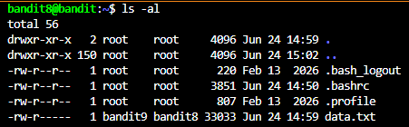
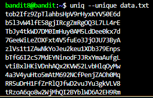
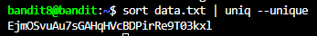

# NHIỆM VỤ
Trong file data.txt, tìm password chỉ xuất hiện ĐÚNG 1 LẦN trong file.

# LỜI GIẢI
Dùng lệnh sau để hệ thống hiển thị toàn bộ file và thư mục trong thư mục hiện tại trong server:
```bash
ls -al
```

Terminal sẽ trả về như sau:



Giống như level trước, nếu ta dùng lệnh `cat data.txt`, terminal sẽ chứa đầy chuỗi ký tự. Thay vào đó, ta có thể dùng lệnh `uniq` - dùng để loại bỏ những hàng trùng nhau. Đối với level này, cú pháp của lệnh `uniq` như sau:
```bash
uniq --unique data.txt # Option "--unique" sẽ bỏ qua tất cả những dòng trùng nhau
```

Tuy nhiên, nó có 1 vấn đề. Nếu ta thực thi lệnh này, terminal sẽ trả về như sau:



Lý do: Lệnh `uniq` CHỈ KIỂM TRA TRÊN NHỮNG DÒNG LIỀN KỀ NHAU. Nếu sử dụng lệnh `cat data.txt` như trên, ta sẽ thấy các chuỗi ký tự phân bổ một cách ngẫu nhiên. 

Để xử lý vấn đề trên, ta phải sắp xếp các chuỗi ký tự theo thứ tự (khi đó các dòng trùng nhau sẽ ở cạnh nhau, và lệnh `uniq` sẽ loại bỏ các dòng đó). Ta phải sử dụng thêm lệnh `sort` (giống như trong `C++`) trước khi dùng `uniq` như sau:
```bash
sort data.txt | uniq --unique
```



# PASSWORD
```
EjmOSvuAu7sGAHqHVcBDPirRe9T03kxl
```
 